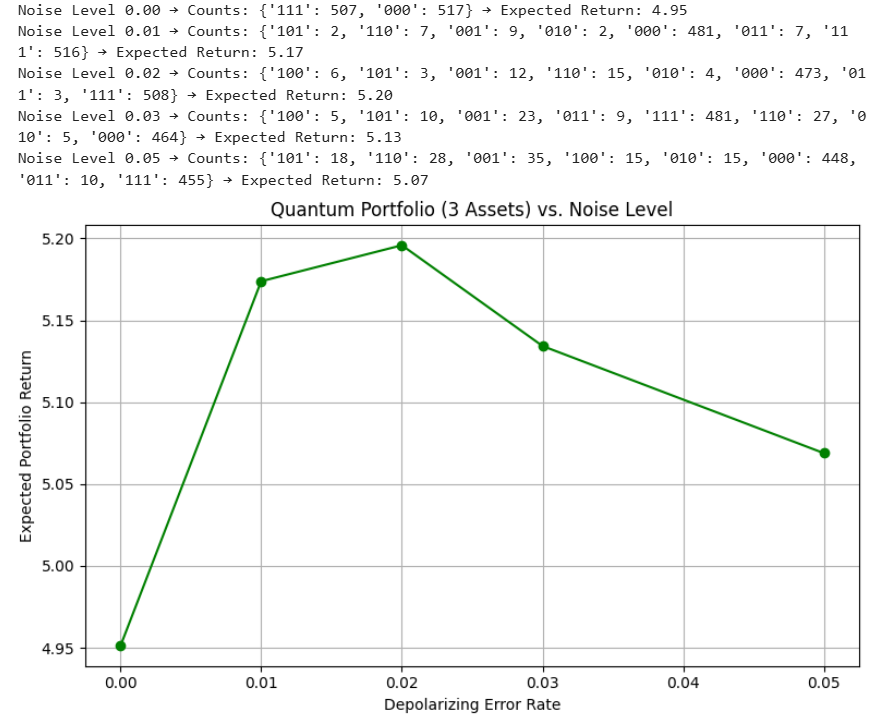

# quantum-noise-analysis-
Exploring noise effects in quantum finance circuits using Qiskit
# Quantum Noise Analysis – Finance Circuits (Qiskit)

This project analyzes the effect of depolarizing noise on a 3-asset quantum portfolio optimization circuit. The results are plotted to observe how noise levels impact expected return.

## 🔬 Summary
- Simulated quantum circuit with different noise levels (0.00 to 0.05)
- Observed portfolio outcome changes using `qasm_simulator`
- Used Qiskit Aer for backend noise modeling

## 📊 Sample Output

## 💡 Key Insight
Interestingly, at low noise levels (e.g., 0.01–0.02), the circuit seemed to yield **better** expected returns. This could hint at constructive interference or noise-induced bias — something worth deeper exploration.

## 🧪 Next Steps
- Test with larger asset portfolios
- Add error mitigation filters (like measurement error mitigation or Zero Noise Extrapolation)
- Benchmark with real hardware

---

👩‍💻 Created during QGSS — open to feedback and collaboration!
